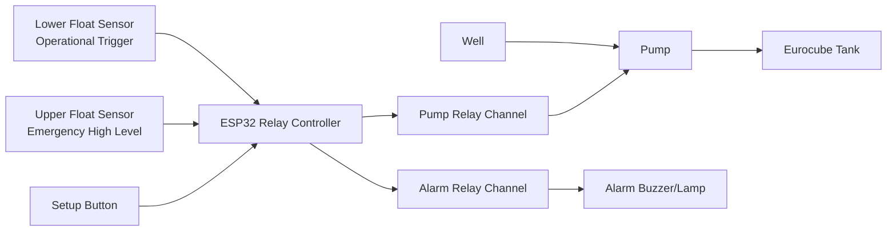

# WATER-LEVEL-CONTROLLER

ESP32 firmware for autonomous well-pump control to fill a storage Eurocube using two side-mounted float level sensors.

## Project Purpose

This project automates water filling from a well into a Eurocube tank and provides:
- Safe automatic filling with overflow protection.
- Alarm handling with emergency pump shutdown.
- Setup mode with local Wi-Fi dashboard.
- OTA firmware update over local AP.
- Persistent settings and lifetime statistics in NVS.

The firmware is designed for ready-made ESP32 relay controller boards with:
- 2-channel relay modules.
- 4-channel relay modules.

The control logic uses two float sensors installed on the tank side wall:
- Lower sensor: operational trigger to start filling when level drops.
- Upper sensor: emergency high-level sensor for immediate alarm/stop.

## Hardware and Platform

### Microcontroller
- ESP32 (Arduino framework, PlatformIO environment `esp32dev`).

### Typical Wiring
- Pump relay output: configurable relay channel (`1..4`).
- Alarm relay output: configurable relay channel (`1..4`, must differ from pump relay).
- Lower float sensor input: `LOWER_LEVEL_SENSOR_PIN`.
- Upper float sensor input: `UPPER_LEVEL_SENSOR_PIN`.
- Setup button input: `SETUP_BUTTON_PIN` (held during boot to arm setup portal).

All sensor inputs use `INPUT_PULLUP` logic in firmware with configurable trigger interpretation (`Closed` or `Open`).

## Electrical Wiring Diagram

### Functional Layout



### ESP32 GPIO Mapping Used by Firmware

| Function | Symbol in Code | ESP32 GPIO |
|---|---|---:|
| Relay channel 1 control | `RELAY_1_PIN` | 25 |
| Relay channel 2 control | `RELAY_2_PIN` | 26 |
| Relay channel 3 control | `RELAY_3_PIN` | 32 |
| Relay channel 4 control | `RELAY_4_PIN` | 33 |
| Lower float sensor input | `LOWER_LEVEL_SENSOR_PIN` | 22 |
| Upper float sensor input | `UPPER_LEVEL_SENSOR_PIN` | 18 |
| Setup button input | `SETUP_BUTTON_PIN` | 23 |

### Relay Board Connection Guide

#### For 2-Channel Relay Boards

| Board terminal | Connect to |
|---|---|
| IN1 | ESP32 GPIO 25 (Relay 1) |
| IN2 | ESP32 GPIO 26 (Relay 2) |
| VCC | 5V (or board-rated supply) |
| GND | ESP32 GND (common ground required) |

Recommended assignment:
- Pump output on Relay 1.
- Alarm output on Relay 2.

#### For 4-Channel Relay Boards

| Board terminal | Connect to |
|---|---|
| IN1 | ESP32 GPIO 25 (Relay 1) |
| IN2 | ESP32 GPIO 26 (Relay 2) |
| IN3 | ESP32 GPIO 32 (Relay 3) |
| IN4 | ESP32 GPIO 33 (Relay 4) |
| VCC | 5V (or board-rated supply) |
| GND | ESP32 GND (common ground required) |

Recommended assignment:
- Pump output on Relay 1 (default).
- Alarm output on Relay 2 (default).
- Relays 3 and 4 reserved for expansion.

### Float Sensor Wiring Notes

- Both level sensors are dry-contact side-mounted switches.
- Inputs are configured as `INPUT_PULLUP`.
- Electrical trigger meaning is configured in software:
  - `Closed`: triggered when contact closes to GND.
  - `Open`: triggered when contact opens.
- Upper sensor has strict emergency priority and always forces pump stop.

### Safety and Electrical Best Practices

- Use an external contactor/starter if pump current exceeds relay board rating.
- Always install fuses/circuit breakers according to local electrical code.
- Keep low-voltage control wiring physically separated from AC mains wiring.
- Use surge protection and proper earthing in pump installations.
- Validate relay active level (`RELAY_ACTIVE_LOW`) for your exact board revision before commissioning.

## Main Features

- Automatic finite-state fill control:
  - `Standby`
  - `FillingUntilLowerClears`
  - `TopOffCountdown`
  - `Alarm`
- Setup freeze mode:
  - Relays forced OFF.
  - Sensors paused.
  - Optional timed diagnostic test run.
- Local setup AP:
  - SSID: `WLC-SETUP`
  - Password: `wlc-setup`
- Embedded web UI (served from firmware, no CDN).
- Adaptive responsive dashboard UI for desktop, tablet, and mobile screens.
- OTA update endpoint for `.bin` uploads.
- NVS persistence:
  - User settings.
  - Runtime statistics.
  - Reset diagnostics and boot counter.
- Loop watchdog support and heartbeat logs.

## What This Firmware Calculates and Tracks

- Pumped water volume in liters, estimated from configured pump productivity (`pumpFlowLpm`) and real pump runtime.
- Pump runtime in seconds (`totalPumpRuntimeSeconds`).
- Number of fill cycles (`fillCycles`), incremented when a new fill sequence starts.
- Number of emergency alarm shutdowns (`alarmCount`), incremented when upper level alarm condition is triggered.

Volume formula used by firmware:

```text
liters_delta = pumpFlowLpm * elapsedMs / 60000
```

Where:
- `pumpFlowLpm` is configured in Settings UI and stored in NVS.
- `elapsedMs` is measured active pump time between loop ticks.

### Metrics Validation Examples

| Scenario | Input | Expected result |
|---|---|---|
| Water volume accumulation | `pumpFlowLpm = 50`, active pump runtime `elapsedMs = 120000` | `liters_delta = 50 * 120000 / 60000 = 100 L` |
| Fill cycle counting | Lower sensor triggers while pump is OFF (new fill start) | `fillCycles` increases by `+1` |
| Emergency shutdown counting | Upper sensor becomes active and alarm state is entered | `alarmCount` increases by `+1`, pump relay turns OFF |
| Runtime accumulation | Pump runs continuously for 15 minutes | `totalPumpRuntimeSeconds` increases by about `900 s` |

Recommended field check sequence:
1. Set known flow value in Settings (for example `10.0 L/min`).
2. Start a controlled test run for a measured duration (for example 6 minutes).
3. Compare expected liters (`flow * minutes`) with dashboard `Total Water`.
4. Trigger upper sensor once and verify `Alarms` increments by exactly one.
5. Trigger one complete refill event and verify `Cycles` increments by exactly one.

## Software Architecture

### Core Modules
- `src/main.cpp`: bootstrap, control FSM, setup mode logic, watchdog, periodic tasks.
- `src/sensors.cpp`: debounced dual-sensor sampling.
- `src/relays.cpp`: relay abstraction and electrical-level handling.
- `src/statistics.cpp`: runtime and water-volume accumulation.
- `src/storage.cpp`: NVS load/save, validation, factory restore.
- `src/ota.cpp`: OTA upload lifecycle and deferred reboot.
- `src/webserver.cpp`: REST API + embedded dashboard UI.

### Public Interfaces
- `include/app_types.h`: shared enums and state structures.
- `include/config.h`: pin map and all compile-time constants.
- `include/*.h`: module interfaces with Doxygen-style API comments.

## Control Logic Summary

1. On boot, firmware initializes storage, sensors, relays, statistics, OTA, and optional setup mode.
2. In normal work mode:
- If lower sensor is triggered, pump starts.
- Once lower sensor clears, top-off countdown starts.
- If upper sensor triggers at any time, alarm mode is entered and pump is stopped immediately.
3. In alarm mode:
- Alarm relay is active.
- System returns to standby only when both sensors are normal.
4. In setup mode:
- Automation is frozen by default.
- Test run can temporarily enable automation for diagnostics with timeout.

## Web Dashboard and API

### Dashboard Views
- Dashboard: live state, relays, sensors, counters.
- Settings: timeout, flow, relay mapping, sensor logic.
- OTA Update: firmware upload progress.
- System: reboot, reset statistics, factory reset, test run.

### Responsive UI Behavior

- The dashboard uses adaptive CSS breakpoints for tablets and phones.
- Navigation switches to mobile sidebar behavior on smaller screens.
- Forms and cards reflow to one-column layout for readable setup on mobile devices.

### Key Endpoints
- `GET /api/status`
- `GET /api/settings`
- `POST /api/settings`
- `POST /api/settings/restore-defaults`
- `GET /api/defaults`
- `GET /api/stats`
- `POST /api/system/reboot`
- `POST /api/system/test-run`
- `POST /api/system/reset-stats`
- `POST /api/system/factory-reset`
- `POST /api/ota/update`

## Build and Flash

### Requirements
- PlatformIO CLI or VS Code + PlatformIO extension.

### Build
```bash
pio run
```

### Upload Firmware
```bash
pio run -t upload
```

### Serial Monitor
```bash
pio device monitor -b 115200
```

## Configuration

Edit compile-time constants in `include/config.h`:
- Relay pin mapping.
- Sensor pins.
- Setup AP credentials.
- Default timeout, flow, and safety limits.
- Watchdog and heartbeat behavior.

## Statistics and Persistence

Stored in ESP32 NVS:
- Total pump runtime (seconds).
- Estimated total pumped water (liters).
- Fill cycle count.
- Alarm event count.
- Last/previous reset reason and boot count.

## Reliability and Safety Notes

- Upper sensor always has priority and triggers emergency stop.
- Pump and alarm relays are separated and validated.
- Setup mode starts with relays OFF to avoid accidental actuation.
- Settings are sanitized on every load/save operation.
- Watchdog feeding is rate-limited and explicit.

## Repository Structure

```text
include/
  app_types.h
  config.h
  ota.h
  relays.h
  sensors.h
  statistics.h
  storage.h
  webserver.h
src/
  main.cpp
  ota.cpp
  relays.cpp
  sensors.cpp
  statistics.cpp
  storage.cpp
  webserver.cpp
platformio.ini
```

## Screenshots (Placeholders)

Add screenshots into `docs/screenshots/` and update links below.

### Dashboard


### Settings


### OTA Update


### System Page


## Future Improvements

- Optional MQTT/Modbus integration.
- External event logging to LittleFS.
- Sensor fault diagnostics (wire break/stuck-state detection).
- Multi-language UI support.

## License

This project is licensed under the MIT License. See the `LICENSE` file.
