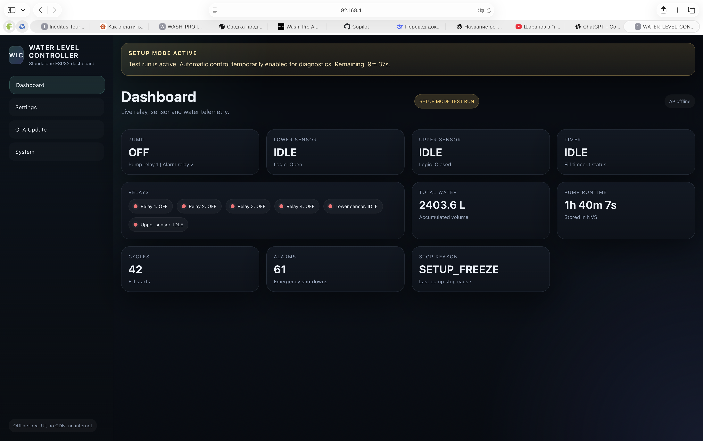
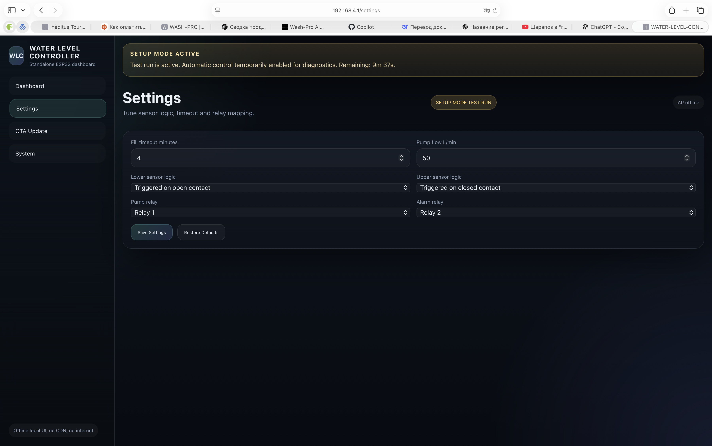
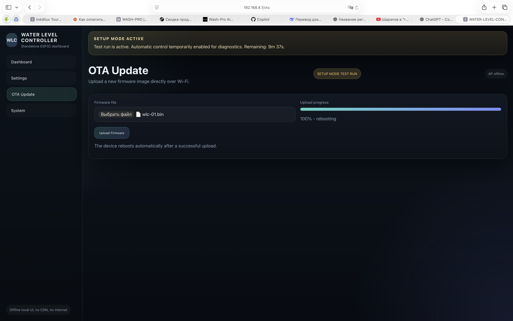
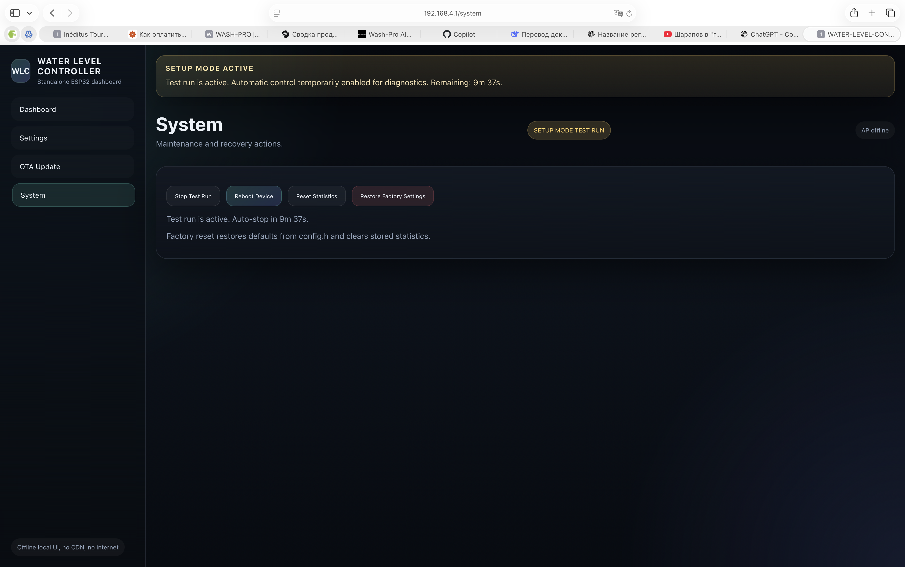

# WATER-LEVEL-CONTROLLER

ESP32 firmware for autonomous well-pump control to fill a storage Eurocube using two side-mounted float level sensors.

## Project Purpose

This project automates water filling from a well into a Eurocube tank and provides:
- Safe automatic filling with overflow protection.
- Alarm handling with emergency pump shutdown.
- Setup mode with local Wi-Fi dashboard.
- OTA firmware update over local AP.
- Persistent settings and lifetime statistics in NVS.

The firmware is designed for ready-made ESP32 relay controller boards with:
- 2-channel relay modules.
- 4-channel relay modules.

The control logic uses two float sensors installed on the tank side wall:
- Lower sensor: operational trigger to start filling when level drops.
- Upper sensor: emergency high-level sensor for immediate alarm/stop.

## Hardware and Platform

### Microcontroller
- ESP32 (Arduino framework, PlatformIO environment `esp32dev`).

### Typical Wiring
- Pump relay output: configurable relay channel (`1..4`).
- Alarm relay output: configurable relay channel (`1..4`, must differ from pump relay).
- Lower float sensor input: `LOWER_LEVEL_SENSOR_PIN`.
- Upper float sensor input: `UPPER_LEVEL_SENSOR_PIN`.
- Setup button input: `SETUP_BUTTON_PIN` (held during boot to arm setup portal).

All sensor inputs use `INPUT_PULLUP` logic in firmware with configurable trigger interpretation (`Closed` or `Open`).

## Main Features

- Automatic finite-state fill control:
  - `Standby`
  - `FillingUntilLowerClears`
  - `TopOffCountdown`
  - `Alarm`
- Setup freeze mode:
  - Relays forced OFF.
  - Sensors paused.
  - Optional timed diagnostic test run.
- Local setup AP:
  - SSID: `WLC-SETUP`
  - Password: `wlc-setup`
- Embedded web UI (served from firmware, no CDN).
- OTA update endpoint for `.bin` uploads.
- NVS persistence:
  - User settings.
  - Runtime statistics.
  - Reset diagnostics and boot counter.
- Loop watchdog support and heartbeat logs.

## Software Architecture

### Core Modules
- `src/main.cpp`: bootstrap, control FSM, setup mode logic, watchdog, periodic tasks.
- `src/sensors.cpp`: debounced dual-sensor sampling.
- `src/relays.cpp`: relay abstraction and electrical-level handling.
- `src/statistics.cpp`: runtime and water-volume accumulation.
- `src/storage.cpp`: NVS load/save, validation, factory restore.
- `src/ota.cpp`: OTA upload lifecycle and deferred reboot.
- `src/webserver.cpp`: REST API + embedded dashboard UI.

### Public Interfaces
- `include/app_types.h`: shared enums and state structures.
- `include/config.h`: pin map and all compile-time constants.
- `include/*.h`: module interfaces with Doxygen-style API comments.

## Control Logic Summary

1. On boot, firmware initializes storage, sensors, relays, statistics, OTA, and optional setup mode.
2. In normal work mode:
- If lower sensor is triggered, pump starts.
- Once lower sensor clears, top-off countdown starts.
- If upper sensor triggers at any time, alarm mode is entered and pump is stopped immediately.
3. In alarm mode:
- Alarm relay is active.
- System returns to standby only when both sensors are normal.
4. In setup mode:
- Automation is frozen by default.
- Test run can temporarily enable automation for diagnostics with timeout.

## Web Dashboard and API

### Dashboard Views
- Dashboard: live state, relays, sensors, counters.
- Settings: timeout, flow, relay mapping, sensor logic.
- OTA Update: firmware upload progress.
- System: reboot, reset statistics, factory reset, test run.

### Key Endpoints
- `GET /api/status`
- `GET /api/settings`
- `POST /api/settings`
- `POST /api/settings/restore-defaults`
- `GET /api/defaults`
- `GET /api/stats`
- `POST /api/system/reboot`
- `POST /api/system/test-run`
- `POST /api/system/reset-stats`
- `POST /api/system/factory-reset`
- `POST /api/ota/update`

## Build and Flash

### Requirements
- PlatformIO CLI or VS Code + PlatformIO extension.

### Build
```bash
pio run
```

### Upload Firmware
```bash
pio run -t upload
```

### Serial Monitor
```bash
pio device monitor -b 115200
```

## Configuration

Edit compile-time constants in `include/config.h`:
- Relay pin mapping.
- Sensor pins.
- Setup AP credentials.
- Default timeout, flow, and safety limits.
- Watchdog and heartbeat behavior.

## Statistics and Persistence

Stored in ESP32 NVS:
- Total pump runtime (seconds).
- Estimated total pumped water (liters).
- Fill cycle count.
- Alarm event count.
- Last/previous reset reason and boot count.

## Reliability and Safety Notes

- Upper sensor always has priority and triggers emergency stop.
- Pump and alarm relays are separated and validated.
- Setup mode starts with relays OFF to avoid accidental actuation.
- Settings are sanitized on every load/save operation.
- Watchdog feeding is rate-limited and explicit.

## Repository Structure

```text
include/
  app_types.h
  config.h
  ota.h
  relays.h
  sensors.h
  statistics.h
  storage.h
  webserver.h
src/
  main.cpp
  ota.cpp
  relays.cpp
  sensors.cpp
  statistics.cpp
  storage.cpp
  webserver.cpp
platformio.ini
```

## Screenshots (Placeholders)

Add screenshots into `docs/screenshots/` and update links below.

### Dashboard


### Settings


### OTA Update


### System Page


## Future Improvements

- Optional MQTT/Modbus integration.
- External event logging to LittleFS.
- Sensor fault diagnostics (wire break/stuck-state detection).
- Multi-language UI support.

## License

This project is licensed under the MIT License. See the `LICENSE` file.
