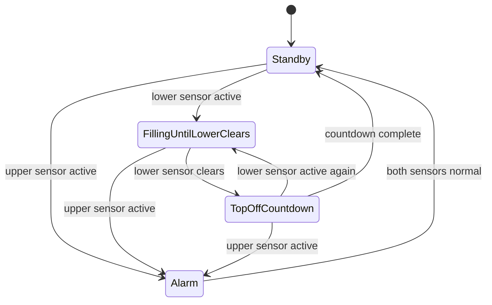
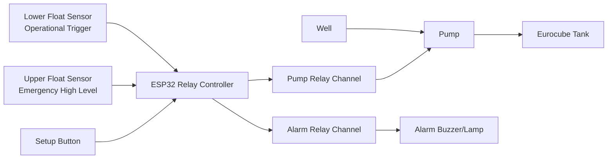

# WATER-LEVEL-CONTROLLER


Production-ready ESP32 firmware for fail-safe, two-sensor well pump automation and Eurocube tank level control.

Suggested GitHub repository short description:
"Fail-safe ESP32 water level controller with dual-float automation, local web dashboard, and OTA updates."

This repository contains a complete solution with:
- Automatic filling logic and emergency protection.
- Responsive local web dashboard for setup and diagnostics.
- OTA firmware updates.
- Persistent telemetry and settings.
- Expanded project and code documentation.

## Table Of Contents

- [Status](#status)
- [Solution Scope](#solution-scope)
- [Key Capabilities](#key-capabilities)
- [System Architecture](#system-architecture)
- [Electrical Wiring Diagram](#electrical-wiring-diagram)
- [Metrics And Calculations](#metrics-and-calculations)
- [Web Interface And API](#web-interface-and-api)
- [Quick Start](#quick-start)
- [Configuration](#configuration)
- [Validation Scenarios](#validation-scenarios)
- [Project Documentation Index](#project-documentation-index)
- [GitHub Wiki](#github-wiki)
- [Repository Structure](#repository-structure)
- [Screenshots](#screenshots)
- [Safety Notes](#safety-notes)
- [Roadmap](#roadmap)
- [License](#license)

## Status

- Lifecycle: Stable release.
- Deployment target: Well pump control panels based on ESP32 relay boards.
- Supported relay blocks: 2-channel and 4-channel.

## Solution Scope

The firmware controls filling from a well into a Eurocube tank using two side-mounted float sensors:
- Lower sensor: operating trigger for refill start.
- Upper sensor: emergency high-level sensor with immediate pump shutdown.

## Key Capabilities

- Deterministic filling state machine with emergency override.
- Alarm handling and alarm event counting.
- Fill cycle counting.
- Estimated pumped water volume in liters.
- Pump runtime accumulation in seconds.
- Setup mode with optional timed diagnostic test run.
- Embedded responsive dashboard (desktop/tablet/mobile).
- Local setup AP.
- OTA update endpoint for firmware binaries.
- Persistent settings and statistics in ESP32 NVS.
- Boot diagnostics: reset reason and boot counter.

## System Architecture

### Control State Machine



### Main Runtime Components

- [src/main.cpp](src/main.cpp): startup, mode transitions, FSM execution loop.
- [src/sensors.cpp](src/sensors.cpp): debounced sensor sampling.
- [src/relays.cpp](src/relays.cpp): relay GPIO abstraction.
- [src/statistics.cpp](src/statistics.cpp): runtime and liters calculation.
- [src/storage.cpp](src/storage.cpp): NVS persistence and sanitization.
- [src/ota.cpp](src/ota.cpp): OTA write/finalize/restart lifecycle.
- [src/webserver.cpp](src/webserver.cpp): embedded SPA and REST API.

## Electrical Wiring Diagram

### Functional Layout



### GPIO Mapping

| Function | Symbol In Code | ESP32 GPIO |
|---|---|---:|
| Relay channel 1 | `RELAY_1_PIN` | 25 |
| Relay channel 2 | `RELAY_2_PIN` | 26 |
| Relay channel 3 | `RELAY_3_PIN` | 32 |
| Relay channel 4 | `RELAY_4_PIN` | 33 |
| Lower float sensor | `LOWER_LEVEL_SENSOR_PIN` | 22 |
| Upper float sensor | `UPPER_LEVEL_SENSOR_PIN` | 18 |
| Setup button | `SETUP_BUTTON_PIN` | 23 |

### Relay Board Connection Guide

#### 2-Channel Relay Board

| Terminal | Connect To |
|---|---|
| IN1 | ESP32 GPIO 25 |
| IN2 | ESP32 GPIO 26 |
| VCC | 5V or board-rated control supply |
| GND | ESP32 GND (common ground mandatory) |

Recommended assignment:
- Pump output: Relay 1.
- Alarm output: Relay 2.

#### 4-Channel Relay Board

| Terminal | Connect To |
|---|---|
| IN1 | ESP32 GPIO 25 |
| IN2 | ESP32 GPIO 26 |
| IN3 | ESP32 GPIO 32 |
| IN4 | ESP32 GPIO 33 |
| VCC | 5V or board-rated control supply |
| GND | ESP32 GND (common ground mandatory) |

Recommended assignment:
- Pump output: Relay 1.
- Alarm output: Relay 2.
- Relays 3 and 4: reserved for expansion.

## Metrics And Calculations

Tracked metrics:
- `totalWaterLiters`
- `totalPumpRuntimeSeconds`
- `fillCycles`
- `alarmCount`

Volume model used in runtime statistics:

```text
liters_delta = pumpFlowLpm * elapsedMs / 60000
```

Where:
- `pumpFlowLpm`: configured pump productivity from settings.
- `elapsedMs`: measured active pump runtime delta.

Data is persisted in NVS and restored across reboots.

## Web Interface And API

### Dashboard Views

- Dashboard
- Settings
- OTA Update
- System

### Responsive Behavior

- Adaptive breakpoints for tablet and mobile.
- Sidebar transforms to mobile navigation pattern on narrow screens.
- Cards and forms collapse into one-column layout.

### API Endpoints

- `GET /api/status`
- `GET /api/settings`
- `POST /api/settings`
- `POST /api/settings/restore-defaults`
- `GET /api/defaults`
- `GET /api/stats`
- `POST /api/system/reboot`
- `POST /api/system/test-run`
- `POST /api/system/reset-stats`
- `POST /api/system/factory-reset`
- `POST /api/ota/update`

## Quick Start

### Requirements

- PlatformIO CLI or VS Code with PlatformIO extension.

### Build

```bash
pio run
```

### Flash

```bash
pio run -t upload
```

### Serial Monitor

```bash
pio device monitor -b 115200
```

## Configuration

Main compile-time constants are located in [include/config.h](include/config.h):
- Relay pin map.
- Sensor pin map.
- Setup AP credentials.
- Default timeout and flow limits.
- Watchdog and heartbeat intervals.

## Validation Scenarios

| Scenario | Input | Expected Result |
|---|---|---|
| Water liters accumulation | `pumpFlowLpm = 50`, `elapsedMs = 120000` | `100 L` delta |
| Fill cycle increment | Lower sensor triggers from standby | `fillCycles +1` |
| Alarm shutdown increment | Upper sensor active event | `alarmCount +1`, pump OFF |
| Runtime accumulation | Continuous run for 15 min | ~`900` runtime seconds |

Field check sequence:
1. Set known flow value in settings.
2. Run a timed test cycle.
3. Compare expected liters with dashboard values.
4. Trigger upper sensor and verify alarm increment.
5. Trigger one full refill and verify cycle increment.

## Project Documentation Index

- [RELEASE_NOTES.md](RELEASE_NOTES.md)
- [CHANGELOG.md](CHANGELOG.md)
- [CONTRIBUTING.md](CONTRIBUTING.md)
- [CODE_OF_CONDUCT.md](CODE_OF_CONDUCT.md)
- [SECURITY.md](SECURITY.md)
- [SUPPORT.md](SUPPORT.md)
- [docs/ARCHITECTURE.md](docs/ARCHITECTURE.md)
- [docs/CODE_REFERENCE.md](docs/CODE_REFERENCE.md)
- [docs/OPERATIONS.md](docs/OPERATIONS.md)
- [docs/TROUBLESHOOTING.md](docs/TROUBLESHOOTING.md)
- [docs/ACCEPTANCE_TEST_PLAN.md](docs/ACCEPTANCE_TEST_PLAN.md)
- [docs/RELEASE_CHECKLIST.md](docs/RELEASE_CHECKLIST.md)
- [docs/WIKI_PUBLISHING.md](docs/WIKI_PUBLISHING.md)
- [GitHub Issue Templates](.github/ISSUE_TEMPLATE)
- [GitHub PR Template](.github/pull_request_template.md)

## GitHub Wiki

- [wiki/Home.md](wiki/Home.md)
- [wiki/Architecture.md](wiki/Architecture.md)
- [wiki/Configuration.md](wiki/Configuration.md)
- [wiki/Control-Logic.md](wiki/Control-Logic.md)
- [wiki/API-Reference.md](wiki/API-Reference.md)
- [wiki/Operations-and-Maintenance.md](wiki/Operations-and-Maintenance.md)
- [wiki/Troubleshooting.md](wiki/Troubleshooting.md)
- [wiki/Release-and-Contribution.md](wiki/Release-and-Contribution.md)

## Repository Structure

```text
include/
  app_types.h
  config.h
  ota.h
  relays.h
  sensors.h
  statistics.h
  storage.h
  webserver.h
src/
  main.cpp
  ota.cpp
  relays.cpp
  sensors.cpp
  statistics.cpp
  storage.cpp
  webserver.cpp
docs/
  ACCEPTANCE_TEST_PLAN.md
  ARCHITECTURE.md
  CODE_REFERENCE.md
  OPERATIONS.md
  RELEASE_CHECKLIST.md
  TROUBLESHOOTING.md
  screenshots/
platformio.ini
```

## Screenshots

### Dashboard


### Settings


### OTA Update


### System


## Safety Notes

- Upper sensor has strict priority and triggers immediate shutdown.
- Use an external contactor if pump load exceeds relay ratings.
- Keep AC mains and low-voltage control wiring physically separated.
- Validate relay polarity (`RELAY_ACTIVE_LOW`) for your relay board revision.
- Follow local electrical regulations for protective devices and grounding.

## Roadmap

- MQTT and industrial integration profiles.
- Enhanced fault diagnostics for sensor line break/stuck states.
- Optional long-term event log on filesystem.

## License

Licensed under MIT. See [LICENSE](LICENSE).
